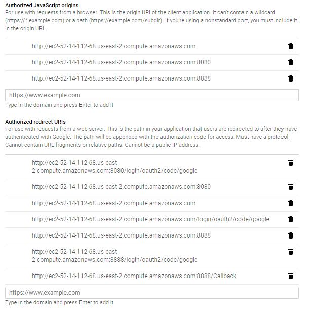

# Community Manager
                   
 The Community Manager is a open-source tool to facilitate Meetup venue, food, and eventually speaker
 arrangements. It provides admins the ability to generate unique URLs which can be sent to venues and 
 foods sponsors. These urls with embedded tokens allow the Community Manager to generate  up-to-date 
 web pages tailored to the individual sponsor. It eliminates emails that contain outdated requests 
 and for the Meetup admin to have to apologize if a vendor responds after they are no longer needed.
 
 It can be cloned from `https://github.com/windust/community-manager`
 
 For more information or to contribute to this project, please contact Seattle Area Java Users Group at freddy.guime@seajug.org.
 
 ---
 
 ## Table of Contents
 
- [Git Started](#git-started)
  * [Prerequisites](#prerequisites)
    + [Hardware Constraints](#hardware-constraints)
    + [Libraries which need to be installed](#libraries-which-need-to-be-installed)
    + [Install via Gradle:](#install-via-gradle-)
      - [Core Dependencies](#core-dependencies)
      - [Testing Dependencies](#testing-dependencies)
  * [Configuration](#configuration)
    + [Google OAuth](#google-oauth)
    + [Google Sheets](#google-sheets)
      - [Initial Setup](#initial-setup)
        * [GoogleSheets Credentials](#googlesheets-credentials)
        * [StorageID](#storageid)
      - [Spreadsheet Setup](#spreadsheet-setup)
        * [1. meetups](#1-meetups)
        * [2. venues](#2-venues)
        * [3. foodSponsors](#3-foodsponsors)
        * [4. admins](#4-admins)
        * [5. speakers](#5-speakers)
        * [6. lightningTalks](#6-lightningtalks)
    + [SCSS Setup](#scss-setup)
    + [Application Configuration](#application-configuration)
      - [Main Configuration File](#main-configuration-file)
        * [createManager](#createmanager)
        * [createStorage](#createstorage)
      - [application.properties](#applicationproperties)
  * [Re-Branding](#re-branding)
- [Development](#development)
  * [System Architecture](#system-architecture)
    + [Model](#model)
      - [Entities](#entities)
      - [Collections](#collections)
      - [DataManager](#datamanager)
    + [Database](#database)
      - [DataStorage](#datastorage)
    + [Exceptions](#exceptions)
    + [Resources](#resources)
      - [CSS](#css)
      - [SCSS](#scss)
    + [Templates](#templates)
  * [Tests](#tests)
    + [Unit](#unit)
    + [Integration](#integration)
    + [Cucumber](#cucumber)
- [Deployment](#deployment)
  * [Docker](#docker)
  * [Amazon Web Services (AWS)](#amazon-web-services--aws-)
    + [Security Groups](#security-groups)
    + [Internet Gateways](#internet-gateways)
    + [Route Tables](#route-tables)
    + [Elastic IP](#elastic-ip)
  * [Internal Changes](#internal-changes)
    + [Google Sheets - Public IP Address](#google-sheets---public-ip-address)
    + [Localhost](#localhost)
- [Security considerations](#security-considerations)
  * [Data backup and redundancy procedure](#data-backup-and-redundancy-procedure)
- [Built with](#built-with)
- [Desired Improvements](#desired-improvements)
- [Authors](#authors)
- [Contributing](#contributing)
- [License](#license)
- [Acknowledgments](#acknowledgments)
  
---

## Git Started

These instructions will get you a copy of the project up and running on your local machine for 
development and testing purposes. See deployment for notes on how to deploy the project on a
live system.

### Prerequisites

#### Hardware Constraints

There are no hardware constraints for running it. This project is intended to run as a cloud application.

#### Libraries which need to be installed

* [JDK 11](https://www.oracle.com/technetwork/java/javase/downloads/jdk11-downloads-5066655.html)
* [NodeJS](https://nodejs.org/en/#download)

#### Install via Gradle:

##### Core Dependencies
* Spring Boot - version: 2.1.2.RELEASE
  * Security
  * OAuth2
  * OAuth2 Client
  * OAuth2 Resource Server
  * Web
  * Test
* Thymeleaf - version: 3.0.11.RELEASE
* Google Sheets API - version: 1.23.0
* Tomcat Embed Jasper

##### Testing Dependencies
* JUnit 5 - version: 5.3.2
* JSoup
* JUnit 4
* Cucumber

### Configuration
This section dives into details regarding how to configure the application. While some sections describe
how to do so from scratch you may only need to alter bits and pieces as the current application contains
most if not all the boilerplate code.

#### Google OAuth
The following describes the procedure to setup Google OAuth for your project

1. Go to [Google Dev Console](https://console.developers.google.com)
    1. Click Credentials tab at left of page.
    2. Click Create Credentials blue button.
    3. Click OAuth client ID from dropdown on button.
    4. Click Web Application under Application Type and hit create.
    5. Under Authorized redirects URIs have this route: <http://localhost:8080/login/oauth2/code/google>
        * If you don't plan on doing any development then replace 'localhost:8080' with your current URI
    6. Hit Save.
    7. Copy OAuth Client ID and Secret from OAuth Client popup to clipboard or some other location.
2. Go to application properties
    1. Paste client ID after: spring.security.oauth2.client.registration.google.client-id=
    2. Paste client Secret after: spring.security.oauth2.client.registration.google.client-secret=
3. Go to build.gradle and under dependencies add (if they aren't already there):
    1. implementation 'org.springframework.boot:spring-boot-starter-oauth2-client'
    2. implementation 'org.springframework.boot:spring-boot-starter-oauth2-resource-server'
    3. implementation 'org.springframework.cloud:spring-cloud-starter-oauth2'
4. Create SecurityConfig class that extends WebSecurityConfigurerAdapter
    1. Create public method configure with parameters HttpSecurity http and throws an Exception.
    2. http: a lot of stuff happens here to get OAuth login working properly.
         1. authorizeRequests():
         2. .antMatchers("/", "/css/main.css", "/js/available_dates.js", "/images/logo_draft_1.png",
           "/venue", "/venueSignUp", "/food", "/foodSignUp").permitAll():
           Here antMatchers and permitAll defines what routes are permitted without authentication.
         3. .anyRequest().authenticated(): anyRequest and authenticated after antMatchers sends any request next through OAuth login.
         4. .oauth2Login().defaultSuccessUrl("/loginSuccess", true): Sends your login after successful login attempt to a route you create in the Controller.
         5. .logout("/log_out").logoutUrl().logoutSuccessUrl(): logoutUrl is your log out method in controller and logoutSuccessUrl is whats displayed after successful logout of app.
         6. .csrf().disable("/"): You'll need to disable the csrf to prevent from getting redirect errors when signing in a second time.
5. Admin Controller to handle login and logout
    1. login method: routes to OAuth login page or your own custom login page.
    2. loginSuccess method with the following parameters: HttpServletRequest request, OAuth2AuthenticationToken authentication
          1. Map<String, Object> properties = authentication.getPrincipal().getAttributes(): This puts principal info into a map.
          2. String email = (String) properties.get("email"): Here we get an email to check the user email.
          3. We use the email to check against a list of valid users on the backend before they are granted access.
    3. logOut method
         1. new SecurityContextLogoutHandler().logout(request, null, null): This line resets the security upon log out and ensures if you are logged out of GMail you are logged out of the app.
         2. loggedIn = false: resets boolean to false
         3. return "redirect:/": redirects user to login page.
         
 #### Google Sheets
 Below is a description on how to connect a Google Spreadsheet(s) to the application
 
 ##### Initial Setup
 
 ###### GoogleSheets Credentials
 
 Go to https://console.developers.google.com/apis/credentials and 
  1. Under create credentials, choose Oauth client id.
  2. Pick web application
  3. In the name field, enter a string that will help you remember what these credentials are used for.
  4. If you know your URI you can enter them here. For deployment, you will need the following with 
  your URI:
   
  5. Click Create
  6. Click on the name of the credentials you just created.
  7. Click on the Download JSON button.
  8. Move the JSON file to the resources folder and store it as credentials.json. 
  (Do NOT push this file to this GitHub repository.)
  
 ###### StorageID
 
 Open up the spreadsheet you wish to use for this project, if you don't have one then go below to 
 [Spreadsheet Setup](spreadsheet-setup) below and come back to this step once that's complete. The 
 URL should look something like this: https://docs.google.com/spreadsheets/d/{storageID}/edit#gid=748055642.
 The storageID is the long ASCII code after the 'd/' and ends at the next '/'. Copy and paste this
 storageID in application.properties right after 'storageID='
 
 ##### Spreadsheet Setup
 
 Go to:
 https://docs.google.com/spreadsheets/u/0/
 It will ask you to login - strangely it will take you to docs, but you can use the upper right hamburger to choose Sheets.
 
 You will see a URL like this:
 https://docs.google.com/spreadsheets/d/**1PKlCf3ykPjNqVjlt9IXzx4gw9LYnQflPA3rtEqM8S1g**/edit#gid=0
 
 The bolded part is the id. Replace the value for storageID in application.properties with this id.
 
 As of June 10, 2019, you are also required to replace the url returned by 
 main/java/com.spinningnoodle.communitymanager/model/GoogleSheetsManager/getDatabaseAccessPage() 
 with the url of your Google Sheet.
 
 In the spreadsheet, create the following tables by clicking on the plus sign (lower left) then right click to change the name to the correct table name. In the first row, you need to add the column names. (Each of these needs to be names exactly as shown.) (Or if you have access to a working spreadsheet, copy and paste the columns in.)
 
 ###### 1. meetups
 
 
 
 - date
 - venue
 - speaker
 - topic
 - description
 - food
 - after
 
 ###### 2. venues
 
 
 
 - name
 - address
 - capacity
 - contactPerson
 - contactEmail
 - contactPhone
 - altContactPhone
 - token
 - requestedDate
 - response
 - foodResponse
 
 ###### 3. foodSponsors
 
 
 
 - name
 - address
 - capacity
 - contactPerson
 - contactEmail
 - contactPhone
 - altContactPhone
 - token
 - requestedDate
 - response
 
 ###### 4. admins
 
 
 
 - email (Be sure to include your email address, as this is the table used to check authorization for the application.)
 - name
 
 (Below this point the tables are not currently used.)
 ###### 5. speakers
 
 
 
 - name
 - bio
 
 ###### 6. lightningTalks
 
 
 
 - name
 - bio
 - topic
 - date

#### SCSS Setup
1. Install [NodeJS](https://nodejs.org/en/#download) for NPM
2. Run `npm install -g sass` in your terminal to install SCSS as a global dependency
3. Install and enable the File Watchers repository plugin on the [Plugins](https://www.jetbrains.com/help/idea/plugins-settings.html) page
4. In the Settings/Preferences dialog, click File Watchers under Tools. The File Watchers page that opens shows the list of already configured File Watchers.
5. Click Add button, choose SCSS predefined template from the list.
6. In the "arguments" command place `$FileName$:../css/$FileNameWithoutExtension$.css` and in "output paths to refresh" `./css/$FileNameWithoutExtension$.css:../css/$FileNameWithoutExtension$.css.map`

#### Application Configuration
This section serves as an overview of everything within the program needs to change to 
reconfigure it to your qualifications. Some of these changes may have already been covered
in directions above.

##### Main Configuration File
The java class called 'Configuration' in the uppermost package contains bean creation.
Any beans used for '@Autowire' should be defined here. Currently contain 'createManager'
and 'createStorage' method.
 
###### createManager
The 'createManager' method creates a GoogleSheetsManager object. If you're not using 
Google Sheets as your database then you'll need to create a Class that implements 
DataManager and place it's constructor in this method to replace GoogleSheetsManager.

###### createStorage
The 'createStorage' method creates a GoogleSheets object. If you're not using 
Google Sheets as your database then you'll need to create a Class that implements 
DataStorage and place it's constructor in this method to replace GoogleSheets. If 
you are using Google Sheets than you may need to place you storageID into the 
'@Value' argument in the parameters.

##### application.properties
The properties that will need to be changed in this file as described in the 
[Google OAuth](#google-oauth) and [Google Sheets](#google-sheets) sections
  * storageID (for Google Sheets)
  * client-id (for Google OAuth)
  * client-secret (for Google OAuth)

### Re-Branding

This application is created with resources specific to the Seattle Area Java Users Group. 
To rebrand for your meetup, 
+ Replace the logos in resources/static/images with logos under the same names for your organization
or find where these images are called and update those references.
+ Update the colors in resources/static/scss/abstracts/_colors.scss with your meetup's color.
  * primary are your organizations two dominant colors.
  * accent - light is the button colors
  * accent - dark is just black
  * base - are black and white.
+ Search the following files for references to Seattle Area Java Users Group and SeaJUG 
and replace as appropriate:
  * /resources/js 
  * /templates
  * /src/main/java/com.spinningnoodle.communitymanager/model/entities/FoodSponsor
   
---

## Development
These are the directions & descriptions on the software architecture and testing setup. 
Described below are naming conventions for files, architecture of the model, and how
to use resources. There is also descriptions of existing tests and how to run them to 
ensure your new addition don't break existing functionality. If you don't wish to make 
any changes to the existing software then skip this section and proceed to [Deployment](#deployment)

Developed in:
>IntelliJ IDEA 2018.3.3 (Ultimate Edition)

### System Architecture
The system follows the MVC pattern. Standard camel case naming conventions are followed. All Collections
include the name Collection and the Entity they are a collection of. Entities that are not intended  to be used as include Entity in the name. Interfaces are named for their basic functionality and do not allow the IDE to denote them rather than using "i".

#### Model
##### Entities
Entities are objects that represent a single row in the database. All entities should extend the "Entity" abstract class. Current entities include:
* Meetup
* Venue
* FoodSponsor
* Admin

Future entities may include Speakers and AfterEvents.

##### Collections
Collections are objects that store and manage groups of entities. Each entity has a corresponding collection that extends from the "Collection" abstract class. Current collections include:
* MeetupCollection
* VenueCollection
* FoodSponsorCollection
* AdminCollection

Future collections may include a SpeakerCollection and AfterEventsCollection. Future collections will need to be Autowired into the current DataManager object.

##### DataManager
Data managers are objects that contain and manage all existing collections. The data manager tells the collections to refresh their data and passes data to the controller. All data managers should implement the DataManager 
interface. Current data managers include:
* GoogleSheetsManager

Future data managers may include SqlManager, CsvManager, MongoManager, etc. Changing the data manager requires a bean in the Configuration.java file utilizing the desired constructor for your DataManager implementation.
Changes may need to be made to the Autowire statements in the controller classes.

#### Database
##### DataStorage
Data storages are objects with CRUD permissions in a place storing persistent data. All data storages should implement the DataStorage interface. Current data storages include:
* GoogleSheets

Future data storages may include SqlStorage, CsvStorage, MongoStorage, etc. Changing the data storage requires a bean in the Configuration.java file utilizing the desired constructor for your DataStorage implementation.
Changes may need to be made to the Autowire statements in the DataManager interface and the EntityCollection abstract class.

#### Exceptions
AttributeException - This exception is thrown at runtime in the app and 
occurs if there is a problem with the attribute.

EntityNotFoundException - This exception occurs when the entity isn't being 
found by the app.

InvalidUserException - This exception occurs when a user attempts to log into 
the app but they are not a valid admin with access to the website. The list of 
valid admins is stored in the database in Google Sheets in the admins spreadsheet.

UnexpectedPrimaryKeyException - This exception happens when the wrong primary 
key is returned. 

#### Resources
##### CSS
CSS code should be added via SCSS or in a secondary CSS file 
(not `resources/static/css/main.css`) which will not be written
 to by the SCSS compiler.

##### SCSS
SCSS directory: `src/main/resources/static/scss`

CSS file path: `src/main/resources/css`

**The SCSS architecture is built according to the [7-1 Pattern](https://sass-guidelin.es/#the-7-1-pattern).**

With [File Watchers](#scss-setup) set up, IntelliJ will automatically watch for changes in SCSS files and compile the css.

*For more information using SCSS and IntelliJ visit the [Official Guide](https://www.jetbrains.com/help/idea/transpiling-sass-less-and-scss-to-css.html).*

#### Templates
The templates are written using Thymeleaf and implement Thymeleaf fragments defined under the fragments folder

### Tests

#### Unit 

Unit tests are written using JUnit5 and Mockito. Only the test of the class GoogleSheets 
makes a call to it's own database. It is recommended that you create a seperate database for this 
test and store it's ID in a text file called config/testGSStorageID.txt. 
#### Integration

Integration tests are written using JUnit5. Currently only the model has integration tests and they 
are stored in test/java/com.spinningnoodle.communitymanager/model/modelIntegrationTest. It is recommended that you create a seperate database for this 
test and store it's ID in a text file called config/testModelStorageID.txt. 

#### Cucumber

---

## Deployment

### Docker
A jar could be built of the project using
`./gradlew build`

A Docker image can then be built using the .jar with the dockerfile provided
 in this project.
`docker build community-manager`

Then the image can be run in a docker container
`docker run community-manager`

### Amazon Web Services (AWS)
This section will describe that steps necessary to deploy this application to
AWS via an EC2 instance on AWS's 'Free Tier'.

#### Security Groups

#### Internet Gateways

#### Route Tables

#### Elastic IP

### Internal Changes

#### Google Sheets - Public IP Address

#### Localhost

---

## Security considerations
The website is secured via Google OAuth. This sends the user to google to login in 
order to access the page. The application then checks if the user's email address matches
one of the addresses stored in the admins page of the google sheets database.

The backend database for the app is also secured via google sheets. The person who 
creates the original google sheets for the app is able to give access to certain 
people to access the database. 

### Data backup and redundancy procedure
The data is currently stored in Google Sheets. To back up the data:
- Go to the Google Sheets page
- Click on File -> Download As
- Choose how you want to download to local machine. (Excel is easiest.)

Google Sheets import functionality can be accessed to restore the data from the same page.

---

## Built with
- OpenJDK 11
- Spring Boot - The web framework used
- Gradle - Dependency Management
- Google Sheets API - API for interacting with Google Sheets, used as database for application
- Google OAuth2 - Login authentication
- JUnit 5 - Unit testing
- Cucumber - Behavioral tests

## Desired Improvements
The following have not been implemented but are suggestions for future work:
- Add a confirmation modal to the available food dates.
- As an admin, when I generate a URL with a token then I would like a copy button to make it easier.
- As an admin, when I generate a URL with a token then I would like an email button so that I can 
generate an editable email.
- As an admin, I want to be able to request speakers in the same way that I request food or venues,
except that they can see other speakers and soft commit to dates.
- As an admin, I want to be able to schedule events for after meetups similar to the way I request 
food or venues.
- As an admin, setting the application up for the first time, I would like a way to have the program
automatically set things up for me.

## Authors
**Freddy Guime** - Chief Software Engineer, Product Owner, and Everything Else

**Kevan Barter** - Contributed to the project by helping with front end design, backend design for Food Sponsor, writing tests for Food sponsor and Admin. He also helped to set up Google OAuth sign implemented on the website.

**Quentin Guenther** - Contributed to the project by helping with backend design, front end design writing tests, setting up SCSS, deploying the website to AWS with Docker, and also implemented the observer pattern into the project.

**Melanie Felton** - Contributed to the project by helping with backend design, front end design, writing tests, connecting the website to the Google Sheets, and implementing the modal. She also was able to incorporate a tab were you can enter info to the Google Sheets from the website.

**Tyler Roemer** - Contributed to the project by helping with backend design, front end design, writing tests, deploying the website to AWS with Docker, and implementing google OAuth. Tyler was als was able to set up Spring Beans in the application.

**Jhakon Pappoe** - Contributed to the project by helping with front end design and some backend design. 

See also the list of [contributors](https://github.com/windust/community-manager/graphs/contributors) who participated in this project.

## Contributing
Please read [CONTRIBUTING](CONTRIBUTING.md) for details on our code of conduct, and the process for submitting pull requests to us.

## License
This project is listed under the Apache License Version 2.0 - see the [LICENSE](LICENSE) for details

## Acknowledgments
- The Seattle Java Users Group community
- The Green River College faculty
- Everyone who participated in usability testing / feedback