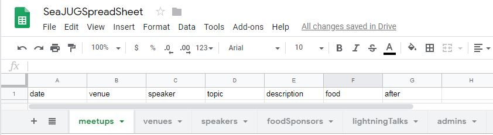
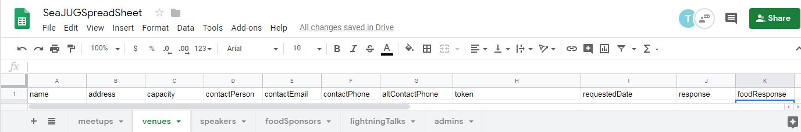
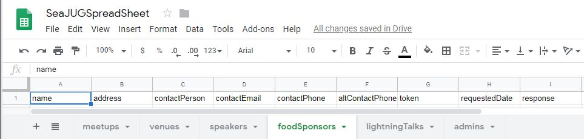
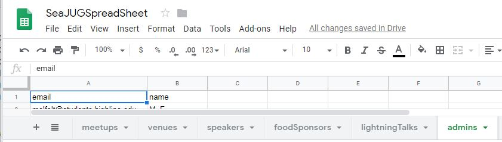
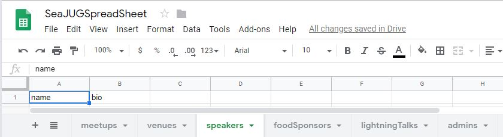
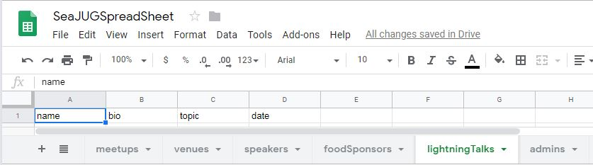
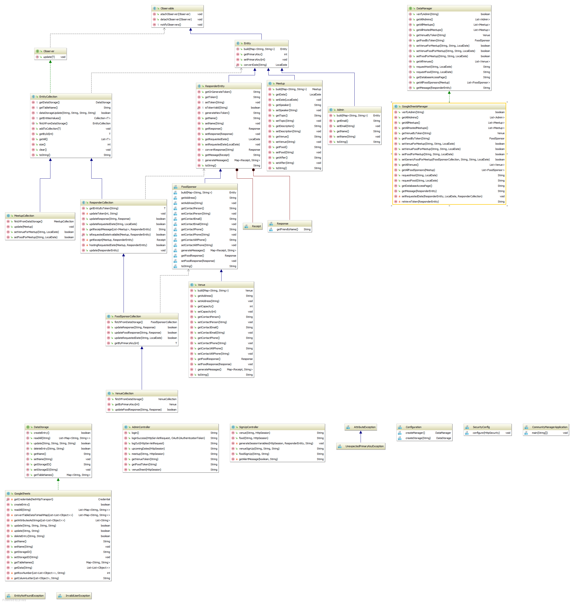

# community-manager

(FIXME: Add full project description and goals of this project.)
The Community Manager is a open-source tool to facilitate Meetup venue, food, and eventually speaker
arrangements. It provides a an admin backend that allows admins to generate unique URLs which can be sent to venues and foods sponsors. These urls with embedded tokens allow the Community Manager to generate  up-to-date web pages tailored to the individual sponsor. It eliminates the need for emails which may contain outdated requests and for the Meetup admin to have to say Sorry if a vendor responds after they
 are no longer needed.

It can be cloned from:
    https://github.com/windust/community-manager

For more information or to contribute to this project, please contact Seattle Area Java Users Group at present@seajug.org.

---

## Table of Contents

- [community-manager](#community-manager)
  - [Table of Contents](#table-of-contents)
  - [Getting started](#getting-started)
    - [Prerequisites](#prerequisites)
      - [Libraries which need to be installed](#libraries-which-need-to-be-installed)
      - [Development Environment](#development-environment)
        - [Using SCSS](#using-scss)
      - [Getting credentials](#getting-credentials)
        - [GoogleSheets Credentials](#googlesheets-credentials)
      - [Spreadsheet setup](#spreadsheet-setup)
        - [1. meetups](#1-meetups)
        - [2. venues](#2-venues)
        - [3. foodSponsors](#3-foodsponsors)
        - [4. admins](#4-admins)
        - [5. speakers](#5-speakers)
        - [6. lightningTalks](#6-lightningtalks)
    - [Installing](#installing)
      - [Setup configuration files](#setup-configuration-files)
  - [Running the tests](#running-the-tests)
    - [Breakdown into the end-to-end tests](#breakdown-into-the-end-to-end-tests)
    - [And coding style tests](#and-coding-style-tests)
  - [System Architecture](#system-architecture)
    - [Model](#model)
      - [Entities](#entities)
      - [Collections](#collections)
    - [DataStorage](#datastorage)
    - [Controller](#controller)
    - [OAuth](#oauth)
    - [Exceptions](#exceptions)
    - [Resources](#resources)
  - [Deployment](#deployment)
  - [Security considerations](#security-considerations)
    - [Data backup and redundancy procedure](#data-backup-and-redundancy-procedure)
  - [Built with](#built-with)
  - [Contributing](#contributing)
  - [Authors](#authors)
  - [License](#license)
  - [Acknowledgments](#acknowledgments)
  
---

## Getting started

These instructions will get you a copy of the project up and running on your local machine for development and testing purposes. See deployment for notes on how to deploy the project on a live system.

### Prerequisites

#### Libraries which need to be installed

* JDK 11

#### Install via Gradle:

* Spring Boot
  * Security
  * OAuth2
  * OAuth2 Client
  * OAuth2 Resource Server
  * Web
  * Test
* Thymeleaf
* Google Sheets API
* Tomcat Embed Jasper

##### Testing Libraries

* JUnit 5
* JSoup
* JUnit 4
* Cucumber

#### Development Environment
Developed in:
>IntelliJ IDEA 2018.3.3 (Ultimate Edition) 
>Build #IU-183.5153.38, built on January 9, 2019
>JRE: 1.8.0_152-release-1343-b26 amd64
>JVM: OpenJDK 64-Bit Server VM by JetBrains s.r.o

##### Using SCSS

SCSS directory: `src/main/resources/static/scss`

CSS file path: `src/main/resources/css`

**The SCSS architecture is built according to the [7-1 Pattern](https://sass-guidelin.es/#the-7-1-pattern).**

1. Install [NodeJS](https://nodejs.org/en/#download) for NPM
2. Run `npm install -g sass` in your terminal to install SCSS as a global dependency
3. Install and enable the File Watchers repository plugin on the [Plugins](https://www.jetbrains.com/help/idea/plugins-settings.html) page
4. In the Settings/Preferences dialog, click File Watchers under Tools. The File Watchers page that opens shows the list of already configured File Watchers.
5. Click Add button, choose SCSS predefined template from the list.
6. In the "arguments" command place `$FileName$:../css/$FileNameWithoutExtension$.css` and in "output paths to refresh" `./css/$FileNameWithoutExtension$.css:../css/$FileNameWithoutExtension$.css.map`

IntelliJ will automatically watch for changes in SCSS files and compile the css.

*For more information using SCSS and IntelliJ visit the [Official Guide](https://www.jetbrains.com/help/idea/transpiling-sass-less-and-scss-to-css.html).*

#### Getting credentials

##### GoogleSheets Credentials

Go to https://developers.google.com/sheets/api/quickstart/java and follow steps 1 - 2b;
(Note: To get a different other than quickstart you may be able to go to https://developers.google.com/sheets/api/quickstart/js and follow directions to create credentials.json.)

#### Spreadsheet setup

Go to:
https://docs.google.com/spreadsheets/u/0/
It will ask you to login - strangely it will take you to docs, but you can use the upper right hamburger to choose Sheets.

You will see a URL like this:
https://docs.google.com/spreadsheets/d/**1PKlCf3ykPjNqVjlt9IXzx4gw9LYnQflPA3rtEqM8S1g**/edit#gid=0

The bolded part is the id. Replace the value for storageID in application.properties with this id.

In the spreadsheet, create the following tables by clicking on the plus sign (lower left) then right click to change the name to the correct table name. In the first row, you need to add the column names. (Each of these needs to be names exactly as shown.) (Or if you have access to a working spreadsheet, copy and paste the columns in.)

##### 1. meetups

- date
- venue
- speaker
- topic
- description
- food
- after

##### 2. venues

- name
- address
- capacity
- contactPerson
- contactEmail
- contactPhone
- altContactPhone
- token
- requestedDate
- response
- foodResponse

##### 3. foodSponsors

- name
- address
- capacity
- contactPerson
- contactEmail
- contactPhone
- altContactPhone
- token
- requestedDate
- response

##### 4. admins

- email (Be sure to include your email address, as this is the table used to check authorization for the application.)
- name

(Below this point the tables are not currently used.)
##### 5. speakers

- name
- bio

##### 6. lightningTalks

- name
- bio
- topic
- date

### Installing

#### Setup configuration files

---

## Running the tests

Explain how to run the automated tests for this system

### Breakdown into the end-to-end tests

Explain what these tests test and why

`Give an example`

### And coding style tests

Explain what these tests test and why

`Give an example`

---

## System Architecture

The system follows the MVC pattern. Standard camel case naming conventions are followed. All Collections
include the name Collection and the Entity they are a collection of. Entities that are not intended  to be used as include Entity in the name. Interfaces are named for their basic functionality and do not allow the IDE to denote them rather than using "i".

### Model

#### Entities
Entities are objects that represent a single row in the database. All entities should extend the "Entity" abstract class. Current entities include:
* Meetup
* Venue
* FoodSponsor
* Admin

Future entities may include Speakers and AfterEvents.

#### Collections
Collections are objects that store and manage groups of entities. Each entity has a corresponding collection that extends from the "Collection" abstract class. Current collections include:
* MeetupCollection
* VenueCollection
* FoodSponsorCollection
* AdminCollection

Future collections may include a SpeakerCollection and AfterEventsCollection. Future collections will need to be Autowired into the current DataManager object.

### Database

#### DataManager
Data managers are objects that contain and manage all existing collections. The data manager tells the collections to refresh their data and passes data to the controller. All data managers should implement the DataManager 
interface. Current data managers include:
* GoogleSheetsManager

Future data managers may include SqlManager, CsvManager, MongoManager, etc. Changing the data manager requires a bean in the Configuration.java file utilizing the desired constructor for your DataManager implementation.
Changes may need to be made to the Autowire statements in the controller classes.

#### DataStorage
Data storages are objects with CRUD permissions in a place storing persistent data. All data storages should implement the DataStorage interface. Current data storages include:
* GoogleSheets

Future data storages may include SqlStorage, CsvStorage, MongoStorage, etc. Changing the data storage requires a bean in the Configuration.java file utilizing the desired constructor for your DataStorage implementation.
Changes may need to be made to the Autowire statements in the DataManager interface and the EntityCollection abstract class.

### Controller

### OAuth

1. Go to website: https://console.developers.google.com
    1. Click Credentials tab at left of page.
    2. Click Create Credentials blue button.
    3. Click OAuth client ID from dropdown on button.
    4. Click Web Application under Application Type and hit create.
    5. Under Authorized redirects URIs have this route: <http://localhost:8080/login/oauth2/code/google>
    6. Hit Save.
    7. Copy OAuth Client ID and Secret from OAuth Client pop to clipboard or some other location.
2. Go to application properties
    1. Paste client ID after: spring.security.oauth2.client.registration.google.client-id=
    2. Paste client Secret after: spring.security.oauth2.client.registration.google.client-secret=
3. Go to build.gradle and under dependencies add:
    1. implementation 'org.springframework.boot:spring-boot-starter-oauth2-client'
    2. implementation 'org.springframework.boot:spring-boot-starter-oauth2-resource-server'
    3. implementation 'org.springframework.cloud:spring-cloud-starter-oauth2'
4. Create SecurityConfig class that extends WebSecurityConfigurerAdapter
    1. Create public method configure with parameters HttpSecurity http and throws an Exception.
    2. http: a lot of stuff happens here to get OAuth login working properly.
         1. authorizeRequests():
         2. .antMatchers("/", "/css/main.css", "/js/available_dates.js", "/images/logo_draft_1.png",
           "/venue", "/venueSignUp", "/food", "/foodSignUp").permitAll():
           Here antMatchers and permitAll defines what routes are permitted without authentication.
         3. .anyRequest().authenticated(): anyRequest and authenticated after antMatchers sends any request next through OAuth login.
         4. .oauth2Login().defaultSuccessUrl("/loginSuccess", true): Sends your login after successful login attempt to a route you create in the Controller.
         5. .logout("/log_out").logoutUrl().logoutSuccessUrl(): logoutUrl is your log out method in controller and logoutSuccessUrl is whats displayed after successful logout of app.
         6. .csrf().disable("/"): You'll need to disable the csrf to prevent from getting redirect errors when signing in a second time.
5. Admin Controller to handle login and logout
    1. login method: routes to OAuth login page or your own custom login page.
    2. loginSuccess method with the following parameters: HttpServletRequest request, OAuth2AuthenticationToken authentication
          1. Map<String, Object> properties = authentication.getPrincipal().getAttributes(): This puts principal info into a map.
          2. String email = (String) properties.get("email"): Here we get an email to check the user email.
          3. We use the email to check against a list of valid users on the backend before they are granted access.
    3. logOut method
         1. new SecurityContextLogoutHandler().logout(request, null, null): This line resets the security upon log out and ensures if you are logged out of GMail you are logged out of the app.
         2. loggedIn = false: resets boolean to false
         3. return "redirect:/": redirects user to login page.

### Exceptions

### Resources

---

## Deployment

Add additional notes about how to deploy this on a live system

---

## Security considerations

### Data backup and redundancy procedure

---

## Built with

- OpenJDK 11
- Spring Boot - The web framework used
- Gradle - Dependency Management
- Google Sheets API - API for interacting with Google Sheets, used as database for application
- Google OAuth2 - Login authentication
- JUnit 5 - Unit testing
- Cucumber - Behavioral tests

## Contributing

Please read CONTRIBUTING.md for details on our code of conduct, and the process for submitting pull requests to us.

## Authors

**Freddy Guime** - Chief Software Engineer, Product Owner, and Everything Else

**Kevan Barter** - Contributed to the project by helping with front end design, backend design for Food Sponsor, writing tests for Food sponsor and Admin. He also helped to set up Google OAuth sign implemented on the website.

**Quentin Guenther** - Contributed to the project by helping with backend design, front end design writing tests, setting up SCSS, deploying the website to AWS with Docker, and also implemented the observer pattern into the project.

**Melanie Felton** - Contributed to the project by helping with backend design, front end design, writing tests, connecting the website to the Google Sheets, and implementing the modal. She also was able to incorporate a tab were you can enter info to the Google Sheets from the website.

**Tyler Roemer** - Contributed to the project by helping with backend design, front end design, writing tests, deploying the website to AWS with Docker, and implementing google OAuth. Tyler was als was able to set up Spring Beans in the application.

**Jhakon Pappoe** - Contributed to the project by helping with front end design and some backend design. 

See also the list of [contributors](https://github.com/windust/community-manager/graphs/contributors) who participated in this project.

## License

This project is listed under the Apache License Version 2.0 - see the LICENSE.md for details

## Acknowledgments

- Hat tip to anyone whose code was used
- Inspiration
- etc
